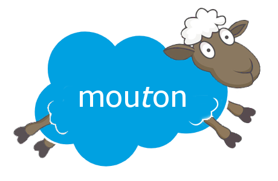

# Mouton

A database migration tool for Salesforce inspired by Flyway

## What is it?

If you've developed on Salesforce using SFDX for a while and implemented an
  automated deployment strategy (i.e. Continuous Integration / CI), you've probably
  noticed that you often still have some manual tasks to do after a deployment.
  Often, these tasks are to add or update data. Since this data is not metadata, it's not
  part of your SFDX project's source code, but it's not user data either.

Examples of these things are:

  - reference data, for example the countries in a `Country` object

  - default data in a new field on an object for existing records

  - initial values of new Custom Metadata types and fields, Custom Settings fields, and 
    Custom Labels

  - `@Schedulable` Apex job schedules

Mouton gives you an automated way of running these "data migrations" and keeping track
of which of them have already been run on each environment you're deploying to. This
way, your deployments can be fully automated again and you won't have to worry about
forgetting that one manual step!

## How does it work

Mouton works with a set of migration scripts in your SFDX projects that you create and
an object on your orgs that keeps track of which migrations have run.

### Step 1: Creating a migration folder

By default, Mouton will look in the `migration` folder under your current working directory.
This folder should contain scripts with a special naming convention:

| type   | version   | separator | description                 | extension
-------- | --------- | --------- | --------------------------- | ---------
| `V`    | `001`     | `__`      | `Insert_countries`          | `.apex`

So the entire filename would be `V001__Insert_countries.apex`.

The versions should increment, so the next script would start with `V002`, then `V003`, etc.

You can use as many digits for your versions as you like, but we recommend at least
three as otherwise you risk running out of version numbers for your new migrations!

### Step 2: 

## Installation

Mouton consists of two parts:

- a managed package that you can install either via AppExchange or from the command line
  with `sfdx force:package:install`

- an SFDX plugin that interacts with the managed package to determine the migration state
  of the org you are deploying to and the migration scripts to run to get it to the state
  in your source code
  
### Installing the package

#### Via AppExchange

TODO

#### Via SFDX

TODO

### Installing the SFDX plugin

Simply run `sfdx plugins:install @assisisolutions/mouton`. The plugin will download
  and install and you will have a new set of SFDX commands starting with `mouton`, e.g.
  `sfdx mouton:version`. Run `sfdx mouton --help` to see all possible commands. 

## FAQ

### Why is it called Mouton?

I started out by calling it M7n (short for "Migration"). 

But then if you read that as leet, it reads "Mtn". Add a few vowels and you have 
  "Mouton", French for "lamb", which is cool because lambs (or sheep, more specifically) 
  look like clouds with heads and legs and Salesforce's logo is a cloud. 

And thus the Mouton name and logo were born :-)
